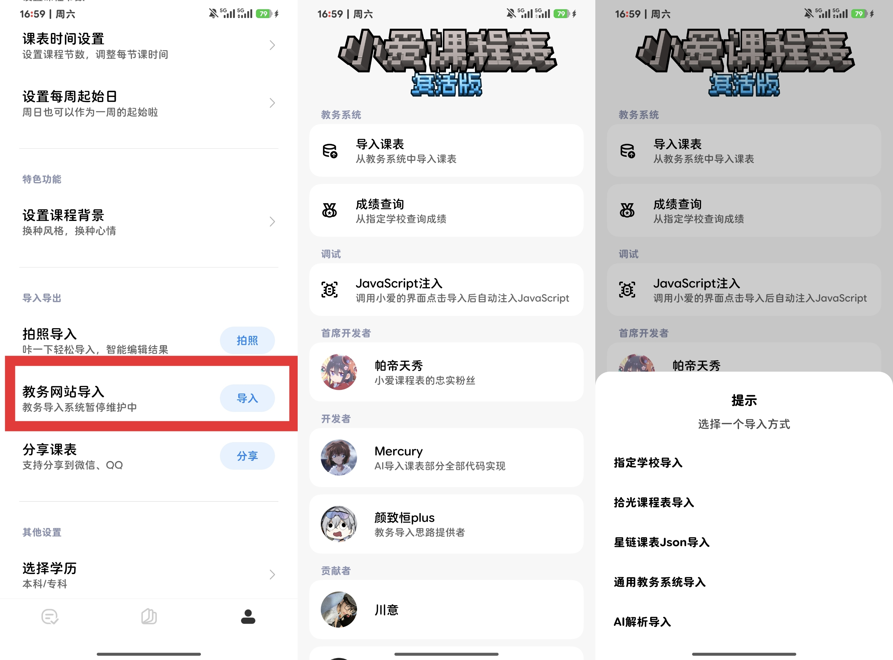

# 小爱课程表导入

恢复小爱课程表的导入功能，可选择AI解析/适配仓库/其他课表软件等导入至小爱课程表  

## 作用域
小爱课程表（com.xiaomi.aischedule）（独立版，非超级小爱）  

下载[小爱课程表](https://www.123865.com/s/87RSVv-R0sfh)（提取码：DArc）此安装包来自荆雪

## 下载
模块版：RELEASE  
内置版：[下载](https://wwaoh.lanzout.com/b0w9l884d)
（密码：b0gf）

## 使用
**启用模块后正常点击导入 - 导入课表 - 选择导入方式**

**导入完成后，课表会同步至超级小爱内置的小爱课表中，切换课表即可**  
## 反馈与适配申请

QQ群:[1090259252](https://qm.qq.com/q/I31mBbA1mU)
